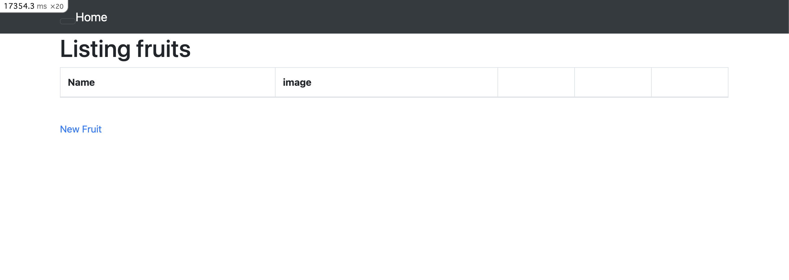
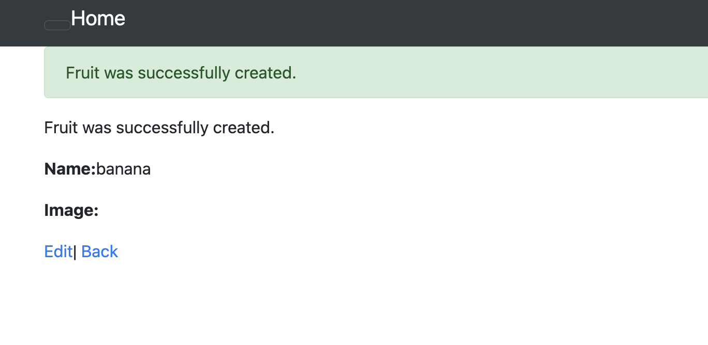
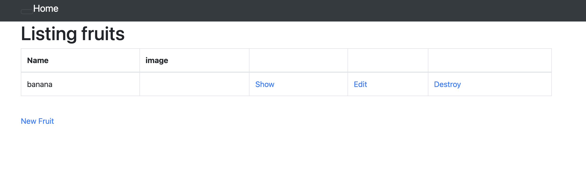
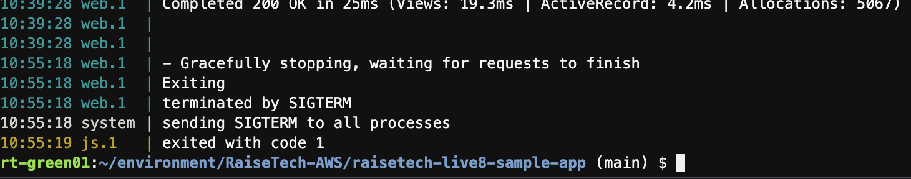
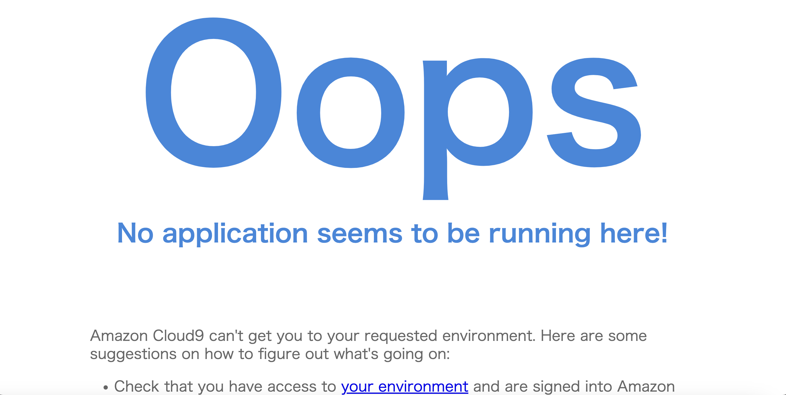
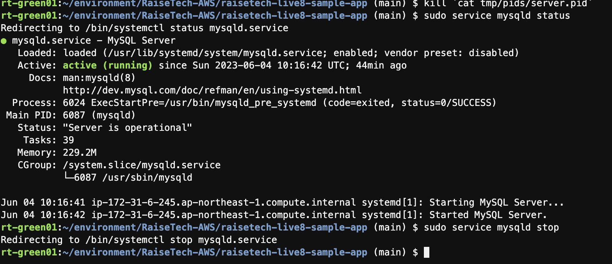
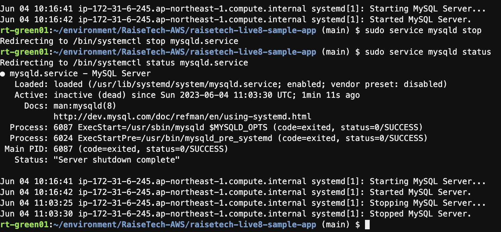
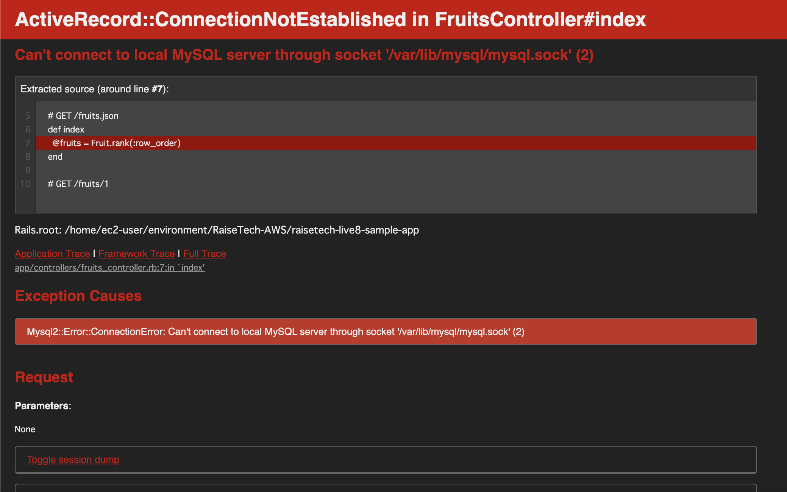

# 第3回課題

## サンプルアプリケーションのデプロイ、ブラウザ表示確認

1. `git clone`で第3回講座のサンプルアプリを入手
2. README.mdに記載されているDBエンジンやRuby等のバージョンを確認
3. Cloud9にインストールにREADMEに書かれているDBエンジンがあるか、Ruby等のバージョンが一致するかを確認
4. rvmコマンドでRuby 3.1.2のインストール（アップグレード）を実施
5. MySQLが存在しなかったため、講座資料：MySQLセットアップ手順に従いインストールを実施
6. MySQLの起動確認を実施
7. npmコマンドでyarnをインストール（`bin/setup`実行時のエラーを解消）
8. `database.yml`を編集
9. `bin/cloud9_dev`が使えるようにパーミッションを修正後、コマンドを実行
10. ブラウザでのアプリ表示を確認

### 初期画面の表示

### 任意データ投入時

### データ投入後の画面表示

## APサーバについて
 - APサーバとバージョン：`puma version 5.6.5`
 - APサーバを停止した場合：Oops画面となり正常表示されない

### APサーバを別ターミナルで停止

### APサーバの停止を元々のターミナルで確認

### APサーバ停止後、正常表示されないことを確認

## DBサーバについて
 - DBサーバと名称：`MySQL Ver 8.0.33`
 - DBサーバを停止した場合：ConnectionNotEstablished画面となり表示されない

### DBサーバを停止
.png`

### 停止されているかステータスを確認

### DBサーバ停止後、正常表示されないことを確認

## Railsの構成管理ツールについて
 - Railsの構成管理ツール:Bundler
 - インストールされたバージョン:2.3.14
 - gem（ライブラリ）の依存関係、バージョンなど互換性を管理するツール

## 課題3での学び
 - Webアプリケーションをデプロイする環境構築を上記手順で下記理解が深まった
   - Webアプリと APサーバ、DBサーバの基本的な関係性
   - エラー発生時の調査での対処方法
   - インストール手順で、構成管理ツール、ライブラリ等の知見
   - 各コマンドの復習

## 感想
手順書に書かれた通りに環境構築はしたことがあったが、 
今回は手順なしで動画を参考に行ったため 
「この手順はなんのために実行するのか？」を確認することができ、 
とても勉強になった。 
マークダウンでエビデンスを埋め込もうと画像表示の 
``を書き込んだが、Cloud9のプレビューで 
`Image not shown`となり（リンクを作ってファイルパスがあっていることは 
確認済み）表示できなかった。 
小さい画像でテストしても、imgタグでリサイズしても表示できなかったため 
今回は、（ここに時間を割きたくなかったので）imageディレクトリ内に 
該当の画像を入れての提出とした。 
次回の提出までに解決しておきたい。 