# 第4回課題

## VPCを作成し、EC2・RDSを構築、EC2からRDSに接続し正常であることを確認する。

1. AWS上に新しくVPCを作成する。
2. 作成したVPCにEC2インスタンスを作成する。（public）
3. 作成したVPCにRDSを作成する（private）
4. ローカル環境のターミナルからEC2に接続する。
5. EC2からRDSに接続し、MySQLへのアクセスを確認する。

### VPCを作成
- リソースは「VPCなど」を設定
- 名前タグは自分で命名（以下工程で今回作成するものには、ぶどうにちなんだ名前をつけた）
- IPv4 CIDRブロックは10.0.0.0/16を指定
- IPv6はなし
- AZの数、サブネットの数はデフォルト
- サブネットのCIDRブロックは/24を指定
- NATゲートウェイはデフォルト
- VPCエンドポイントはなしを選択
- DNSオプションはデフォルト

VPC 詳細 
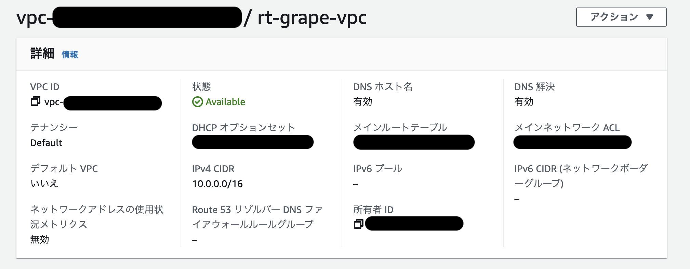

VPC Resource map 
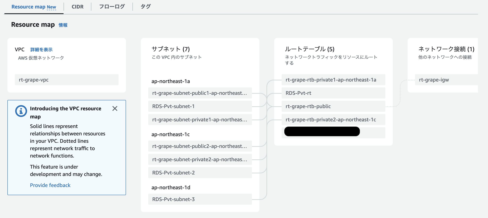

### ap-northeast-1aにEC2を構築
- マシンイメージはAmazon Linux２を選択
- インスタンスタイプはt2.micro（無料枠）を選択
- 新しいキーペアを作成
- セキュリティグループを設定

インスタンス概要 
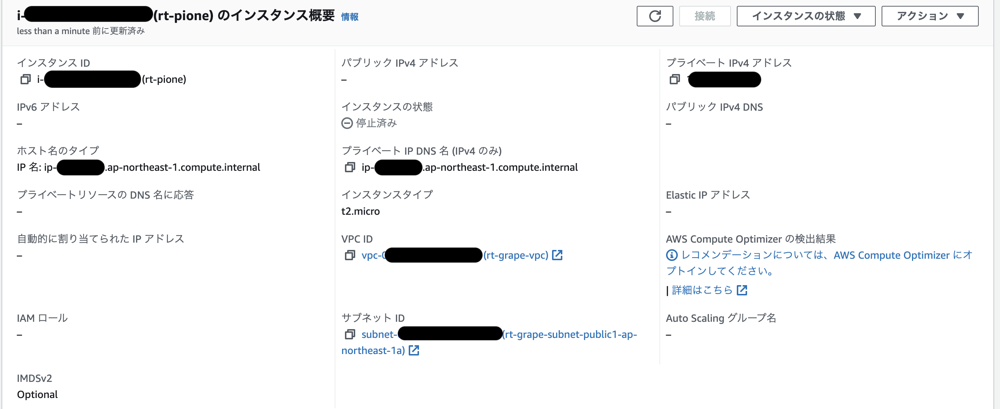

インスタンス詳細 
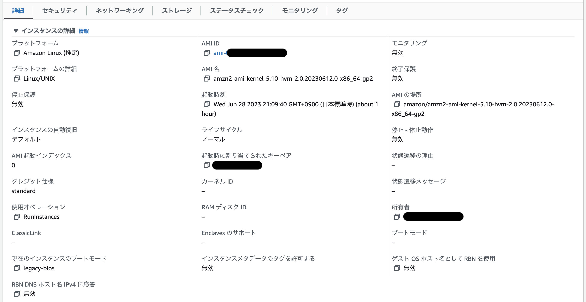

ホストとプレイスメントグループ、他 
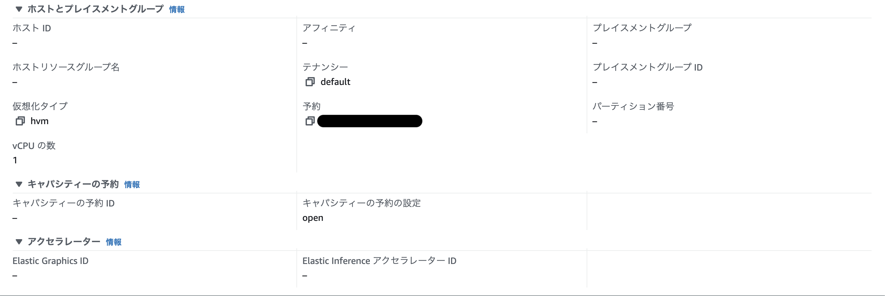

セキュリティの詳細 
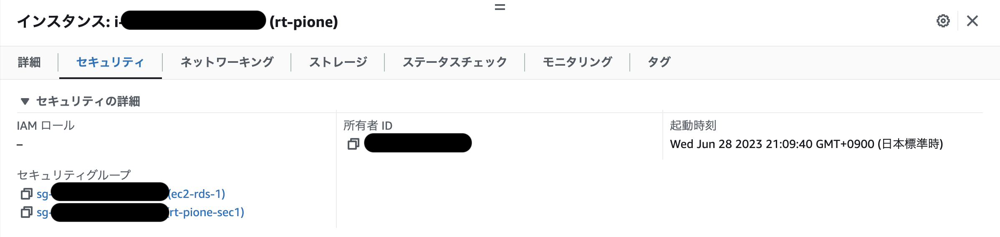

### ap-northeast-1aにRDSを構築
- 作成方法は標準作成を選択
- エンジンオプションはMySQLを選択
- テンプレートは無料利用枠を選択
- DBインスタンスはdb.t3.microを選択
- 作成したEC2を起動した状態で「EC2コンピューティングリソースに接続」を選択
- EC2インスタンスは自分で作成したものを選択
- ユーザ名とパスワードを設定
- その他デフォルト

概要、接続とセキュリティ 
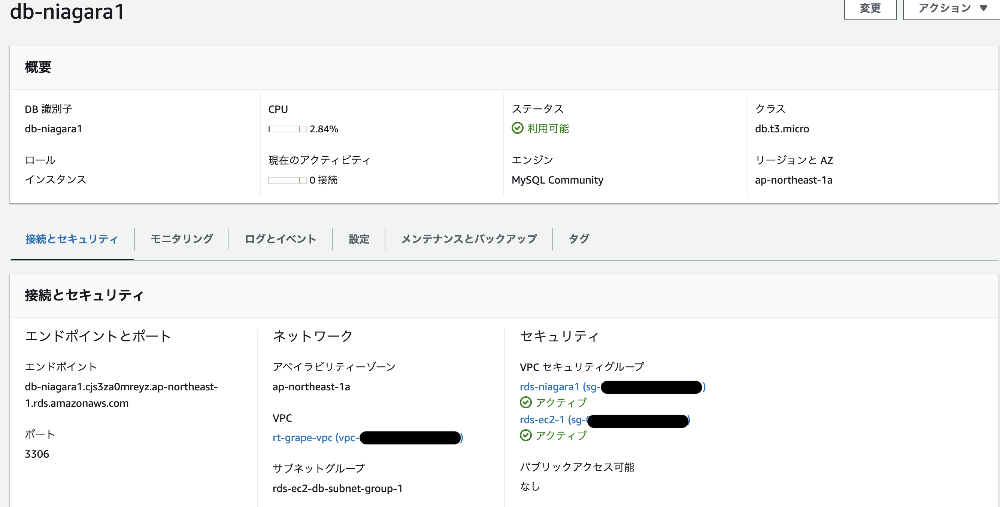

接続とセキュリティ続き、セキュリティグループ 
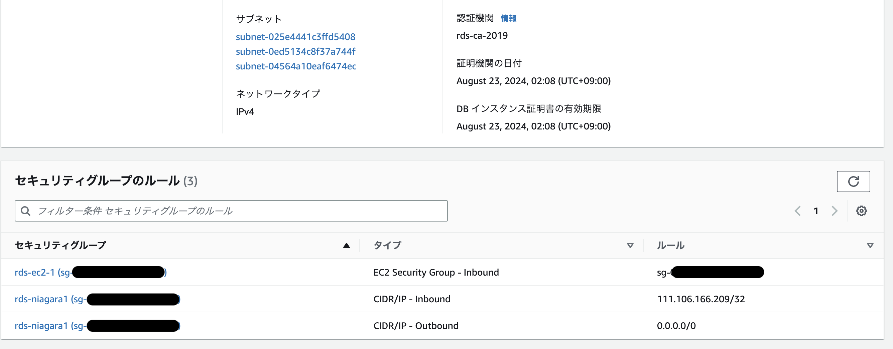

レプリケーション、他 
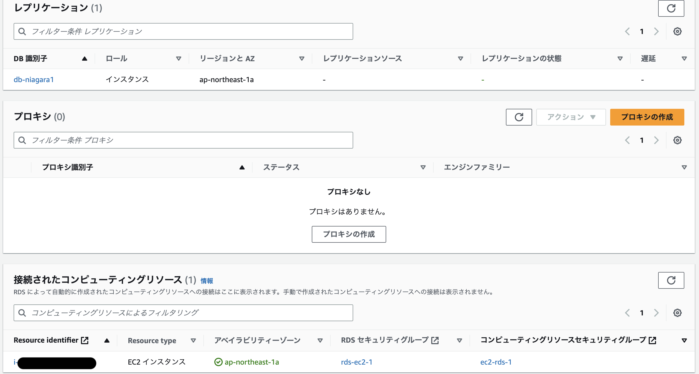

### ローカルのターミナルからEC2への接続確認
- ターミナルを起動
- `~/.ssh`ディレクトリを作成
- ダウンロードしたpemを`~/.ssh`配下へ移動
- `chmod 600`でパーミッションを変更
- `ssh -i ~/.ssh/○○.pem ec2-user@ec2のグローバルIP`でEC2にSSH接続

EC2にSSH接続 
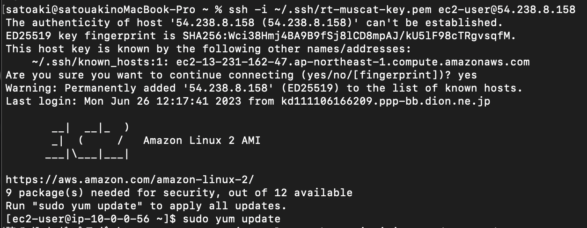

### EC2からRDSに接続
- `sudo yum install mysql`でmysqlをインストール
- `mysql -u admin -p -h RDSのエンドポイント`でRDSに接続
- 正常に接続されたことを確認

EC2からRDSに接続 
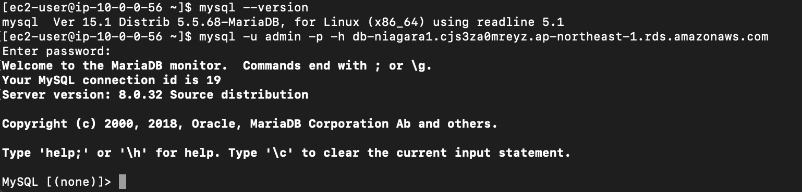

### 感想
なかなか作業時間が取れず、ネット検索で情報収集をしたり 
Udemyの昔購入したAWS講座を視聴したりして知見を深めていた。 
AWSはコンソールもそうだが、設定画面も移り変わりが激しく 
ネットで調べた情報は古くなっていた。 
それでも、調査していた甲斐があって実際の構築にはさほど 
困ることはなかった。 
今回RDSの「EC2コンピューティングリソースに接続」のところで 
選択に悩んだ。 
RDS – EC2間のワンクリック接続セットアップの機能という説明を読み 
今回そちらを選択したが、選択しない場合は設定方法がどう変わるのか 
試してみたい（自分への宿題）。