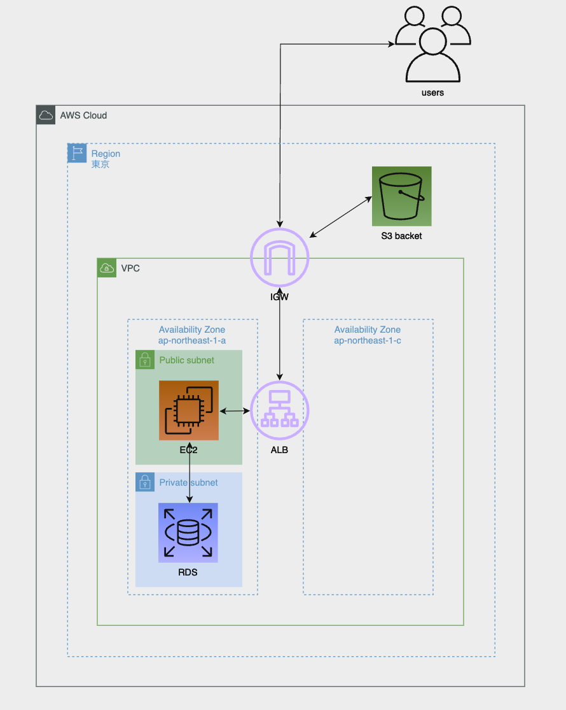

# 第5回課題

## EC2上にサンプルアプリケーションをデプロイして動作させる
### 事前準備
- 下記サイトを参照に必要パッケージのインストールやアップデートを実施
https://pikawaka.com/rails/ec2_deploy
※サンプルアプリケーションのReadMeに記載されたものとバージョンに差異がないかも確認。

- サンプルアプリをclone
サンプルアプリデプロイ用のディレクトリ`/var/www`を作成し、その配下にサンプルアプリをclone  
※`/home/ec2-user`にcloneされることを想定して作られていたようだったので、  
アプリ内の設定を`/var/www`に置き換えした。

### 組み込みサーバで動作確認  
- セットアップ  
`bundle install`で、必要パッケージをインストール。  
※`aws-sdk-s3`と`unicorn`がインストールされていることを確認。
- アプリ起動
`bin/setup`が正常に終了したことを確認し、`bin/dev`にてアプリ起動。
##### ターミナル

##### 画面

### Nginxを導入
- Nginx単体の動作確認
##### ターミナル

##### 画面

- puma起動確認
##### ターミナル

- Nginxの設定ファイルをpuma用に作成しNginxを再起動
##### ターミナル

- puma+Nginxでの動作確認
##### 画面

### Unicornを導入
- Unicorn起動確認
##### ターミナル

- Nginxの設定ファイルをUnicorn用に書き換えてNginxを起動
##### ターミナル

- Unicorn＋Nginxでの動作確認
##### 画面

## ELB(ALB)を追加する
- ALBヘルスチェック
##### 画面(コンソール)

- ALBデフォルトDNSでの接続確認  
※development.rbにconfig.hosts追記後に表示確認
##### 画面

## S3を追加する
- S3 bucketを作成
##### 画面（コンソール）

- アプリ用にシークレットアクセスキーを作成
- storage.ymlとdevelopment.rbをS3を使うように編集
- アプリケーションでの動作確認  
アプリで登録した画像をS3に登録
##### 画面

##### 画面（コンソール）

※アプリから登録した画像が、即時でS3に登録されたことを確認

## 構築した環境の構成図を作成する

## 感想
事前にいろいろと調べてから実際に動かしたからか、実際の確認は割とスムーズだった。  
S3の使い方に迷い、`mountpoint-s3`も調べてみたものの  
「そういえばアプリはどんな動きを想定しているのだろう？」  
と視点を変えて調べてみたら、マウントする必要がなかったので`aws-sdk-s3`を  
使う方向で調べ直し、アプリ内の設定ファイルのコメントを読んで、変更が必要な  
箇所を洗い出しして、動かしたところこちらもすんなりできた。  
動作確認は、数週間前に終わっていたものの、提出用のmdファイルを作成する時間が  
なかなか取れず、スクリーンショットを整理するのも時間をおきすぎたせいで  
どれがどれかわからなくなり大変だった。  
最後に構成図を書きながら、それぞれの振り返りができてよかった。  
ログと設定ファイルの中身をよく読むことが、解決へのいちばんの近道だった。